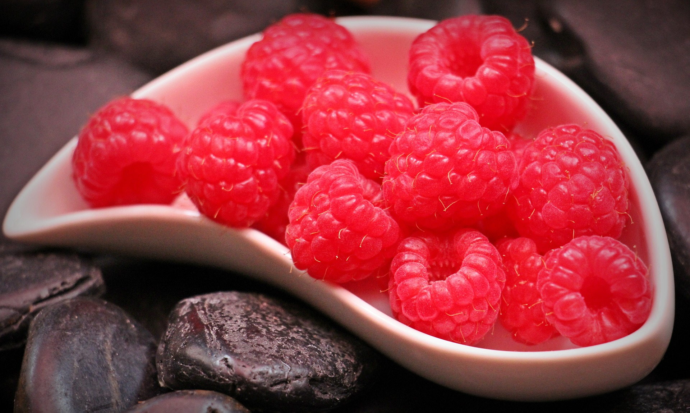

---------------------
  My Plate
---------------------

My Plate Making API code
========================

Use below code to cook a delicious dish. Use either stove or microwave.

    .. literalinclude:: ../hellofood.c
         :lines: 11-17
    

Ingredients 
======================
=====  =====  ======
   Inputs     Output
------------  ------
  A      B    A or B
=====  =====  ======
False  False  False
True   False  True
=====  =====  ======

Time to cook
======================

.. tabularcolumns:: |l|c|p{5cm}|

+--------------+---+-----------+
|  super fast | 2 | 3         |
+--------------+---+-----------+

